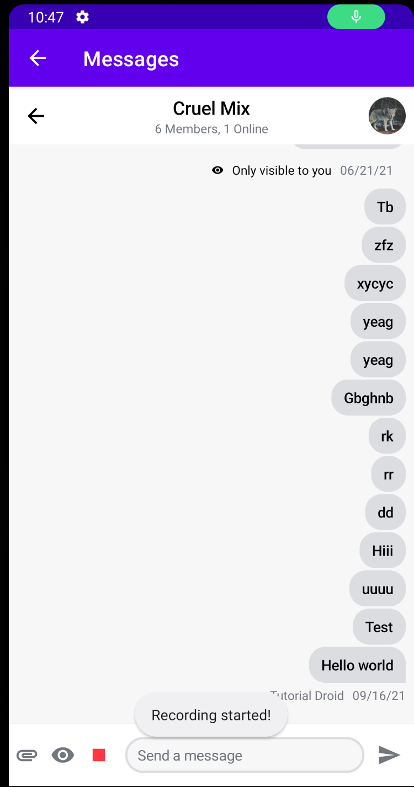
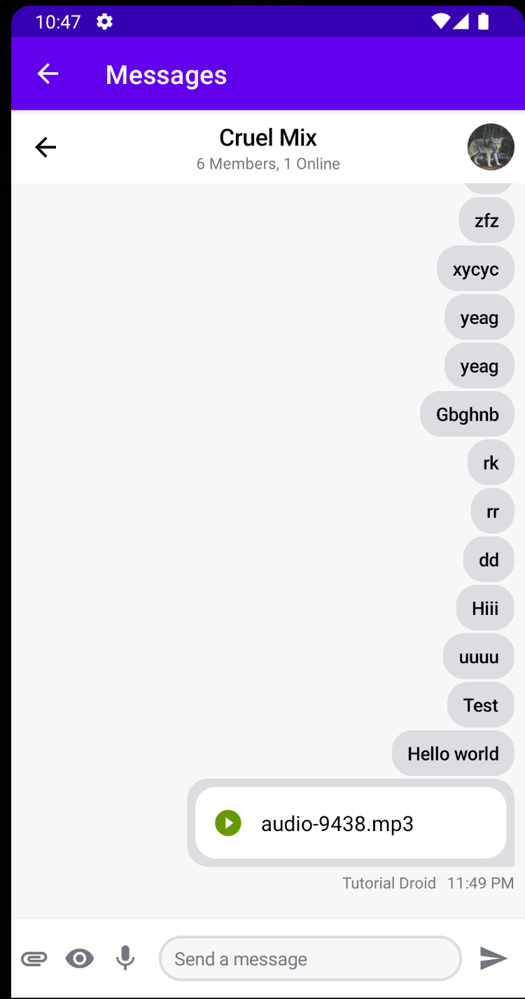
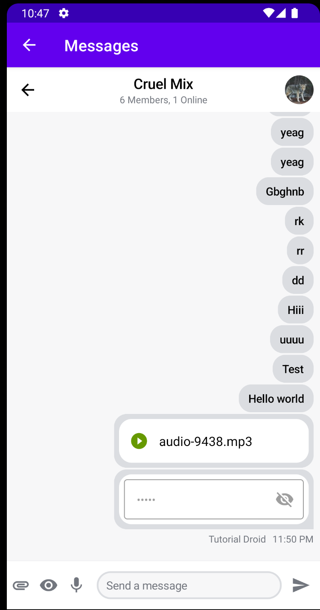

# Custom Attachments in Stream Compose SDK
## Introduction 

Stream recently [announced](https://getstream.io/blog/jetpack-compose-sdk/) their Jetpack compose SDK which is currently in beta.  This follows the announcement of the stable version of Jetpack Compose.

In this tutorial, you'll learn

- AttachmentFactory and creating a custom Attachment Factory.
- Customizing Stream [Jetpack Compose UI Components](https://getstream.io/chat/docs/sdk/android/compose/overview/)
- Sending custom files as attachments.
- Adding previews for your custom attachment.

**Note:** You can try out the new SDK by checking out the [Jetpack Compose Chat Tutorial](https://getstream.io/chat/compose/tutorial/) 

Stream Chat SDK supports several attachments by default for example images, URLs, gifs and videos. With the XML UI components, you could create a custom `AttachmentViewFactory` class that would be used to render your attachment preview. The good news is even with the Composec components, you still have this ability :]

Let's start by getting to know what is an Attachment Factory.

## Introduction to `AttachmentFactory`

This is a class that allows you to build and render your attachments to the list of messages. 

## Examples of Default `AttachmentFactory`

As earlier mentioned, the Stream Chat SDK provides you with several factories to handle image, video, URL and GIF attachments.  

## Creating Your Attachment Factory

For you to create your attachment factory, you'll need:

- A view to show the attachment
- Have a new `AttachmentFactory` that checks for your custom attachment and specifies how to render the attachment.

You'll be learning how to create this in the next section.

## Custom Password Attachment

You have this attachment that you'd want to send to a certain channel:

```kotlin
val attachment = Attachment(
    type = "password",
    extraData = mutableMapOf("password" to "12345"),
)
val message = Message(
    cid = channelId,
    attachments = mutableListOf(attachment),
)
```

This is a message with an attachment that contains a password. The password is passed through the `extraData` attribute. By default, the SDK doesn't know how to render this attachment.

To render this, first create a view that shows your password. In this case it'll be a composable. Here's how the code looks like:

```kotlin
// 1
@Composable
// 2
fun PasswordAttachmentView(attachmentState: AttachmentState) {
    // 3
    var showPassword by remember { mutableStateOf(false) }
    // 4
    val passwordAttachment = attachmentState.messageItem.message.attachments.first { it.type == "password" }
  
    Row(
        modifier = Modifier
            .padding(6.dp)
            .clip(ChatTheme.shapes.attachment)
            .background(Color.White)
    ) {
        // 5
        OutlinedTextField(
            value = passwordAttachment.extraData["password"].toString(),
            onValueChange = {},
            modifier = Modifier
                .fillMaxWidth()
                .padding(6.dp)
                .height(50.dp),
            enabled = false,
            visualTransformation = if (showPassword) VisualTransformation.None else PasswordVisualTransformation(),
            keyboardOptions = KeyboardOptions(keyboardType = KeyboardType.Number),
            trailingIcon = {
                val image = if (showPassword) Icons.Filled.Visibility else Icons.Filled.VisibilityOff

                IconButton(onClick = { showPassword = !showPassword }) {
                    Icon(imageVector = image, null)
                }
            }
        )
    }
}
```

Here's what the code above does:

1. Annotating the function using the `@Composable`  annotation. This lets you build the component's UI programmatically as opposed to the previous way of using XML.
2. The function takes `AttachmentState`  as an argument. `AttachmentState` is a class that handles the state of the attachment. It has a `MessageItem` which contains all the information about a particular attachment.
3. This stores the `showPassword` in memory of the composable by using the `remember` composable. This value is observable which triggers a recomposition of the composable when the value changes.
4. Looks for messages whose `type` is password from the `AttachmentState`.
5. This is composable for inputs.  Here, the value of the `OutlinedTextField` is set by getting the `extraData` that was passed to the attachment. Notice that the `visualTransformation` and `trailingIcon` are dependent on the value of `showPassword`. This helps in toggling the password visibility.

Now that you already have the view that is supposed to render your attachment, next is creating the custom `AttachmentFactory` 

## Creating Custom Password AttachmentFactory

You have to create your own factory. This is how it will look like:

```kotlin
@ExperimentalStreamChatApi
val customAttachmentFactories: List<AttachmentFactory> = listOf(
     AttachmentFactory(
        canHandle = { attachments -> attachments.any { it.type == "password" } },
        content = @Composable { PasswordAttachmentView(it) }
    )
)
```

This is a list AttachmentFactories. Each `AttachmentFactory` has the following two properties:

- `canHandle` - This is where you specify what type of attachments the factory can handle. In this case, it's the attachments with `type` password.
- `content` - This specifies the view that renders your custom attachment. This uses the `PasswordAttachmentView` composable that you've just seen earlier.

With this done, the only remaining thing to do is to add this custom factory to the `ChatTheme`. To do this override the `attachmentFactories`:

```kotlin
ChatTheme(
    attachmentFactories = customAttachmentFactories + defaultFactories
)
```

To get `default` factories you simple do this:

```Koltin
val defaultFactories = StreamAttachmentFactories.defaultFactories()
```

Now when you send a message with a `type` password. This is how it appears on the MessageList:


Tapping the password visibility icon, the password is shown:


This is possible because of the `showPassword` variable which makes the `OutlinedTextField` to be recomposed and the icon to change too. You can toggle in between the states easily.  Now all attachments with `type` password will be rendered with this view by default.

You've seen how to send attachments that don't have files. In the next section, you'll be learning how to send record voice notes and send them as custom attachments too.

## Custom Audio Attachment

Sending audio files is a much sort after feature in chat apps. With the Stream Chat SDK, you can send audio files as custom attachments. Similar to the password attachment, you'll need to:

- Create and send your custom attachment.
- Create a custom view for your attachment.
- Add your custom `AttachmentFactory`.

Here's the message with the attachment:

```kotlin
val attachment = Attachment(
    type = "audio",
    upload = File(output),
)
val message = Message(
    cid = channelId,
    attachments = mutableListOf(attachment),
)
```

For attachments with files, you have to use the `upload` property. Which uploads your attachment and you can access the attachment using the `url` property of the attachment.

Now that your attachment is ready to be sent, you'll learn how to create a preview of the same next.

## Previewing Custom Attachments

For audio, you'll need a UI with a play functionality so that you can listen to the audio that has been sent. For playing you'll use the android `MediaPlayer` for playing the audio file.

This is how you composable will be:

```kotlin
@Composable
fun AudioAttachmentView(attachmentState: AttachmentState) {
    // 1
    var playing by remember { mutableStateOf(false) }
    // 2
    val audioAttachment = attachmentState.messageItem.message.attachments.first { it.type == "audio" }
    // 3
    val player = PlayerWrapper(
        player = MediaPlayer.create(LocalContext.current, Uri.parse(audioAttachment.url)),
        onStop = { playing = false },
    )

    // 4
    DisposableEffect(Unit) {
        onDispose { player.release() }
    }

    ConstraintLayout(
        modifier = Modifier
            .fillMaxWidth()
            .padding(6.dp)
            .clip(ChatTheme.shapes.attachment)
            .background(Color.White)
    ) {
        val (iconButton, text) = createRefs()
        // 5
        IconButton(
            onClick = {
                playing = !playing
                if (playing) player.play() else player.stop()
            },
            modifier = Modifier
                .width(50.dp)
                .height(55.dp)
                .constrainAs(iconButton) {
                    start.linkTo(parent.start)
                    top.linkTo(parent.top)
                }
        ) {
            Image(
                painter = painterResource(
                    when (playing) {
                        true -> R.drawable.ic_baseline_stop_circle_24
                        false -> R.drawable.ic_baseline_play_circle_filled_24
                    }
                ),
                contentDescription = "Play Icon",
            )
        }
        val fileName = audioAttachment.name ?: ""
        // 6
        Text(
            text = fileName,
            fontSize = 16.sp,
            modifier = Modifier
                .constrainAs(text) {
                    start.linkTo(iconButton.end)
                    top.linkTo(iconButton.top)
                    bottom.linkTo(iconButton.bottom)
                }
        )
    }
}
```

To explain the code above:

1. This is another state variable that tracks the playing state. It helps in toggling between the play and stop icons.
2. Gets the audio attachment from `AttachmentState`.
3. You're creating a `PlayerWrapper` instance which has utility methods for playing, stopping and releasing the `MediaPlayer`. You also pass the audio file as URI.
4. This calls the `release()` function from `PlayerWrapper` class to clean up the  `MediaPlayer`.
5. This is an `IconButton` composable that changes state depending on the state of the player. Tapping this plays the audio and shows the stop icon. Tapping the stop icon will stop the audio.
6. This is a composable which shows the name of the file.

You have the preview ready, you'll be creating a custom messages screen that has a record button at the bottom.

## Customizing the Messages Screen

With the new Compose UI components, it's easy for you to add chat features to your app and customize these components to your needs. You'll be learning how to customize some of these components in the next few sections.

For the Audio recording functionality, you'd want to add a record icon on your message input layout  as:


In the above image, notice there's the password icon that sends the password attachment that you've just learned. There's also a microphone icon that will have all the recording functionality.

To have such a UI you'll begin by customizing your Messages Screen as:

```kotlin
ChatTheme(
    attachmentFactories = customAttachmentFactories + defaultFactories
) {
    CustomUi { onBackPressed() }
}
```

Here, you use the `ChatTheme` from Stream Chat SDK which provides you with all the default styling. You can also choose to use a custom theme if you need different styling.  You also pass your custom factories to handle the custom attachments. And lastly, you set the content to a custom one. If you need the default channel messages behavior you only need:

```kotlin
ChatTheme {
    MessagesScreen(
        channelId = channelId,
        messageLimit = 30,
        onBackPressed = { finish() }
    )
```

Notice how you're adding the functionality with a few lines on code :] But for now, let's have a look at some of the components on the `CustomUi`

```kotlin
@Composable
    fun CustomUi(onBackPressed: () -> Unit) {
        val isShowingAttachments = attachmentsPickerViewModel.isShowingAttachments
        val selectedMessage = listViewModel.currentMessagesState.selectedMessage
        val user by listViewModel.user.collectAsState()

        Box(modifier = Modifier.fillMaxSize()) {
            Scaffold(
                modifier = Modifier.fillMaxSize(),
                bottomBar = {
                    CustomAudioComposer()
                },
                content = {
                    Column(modifier = Modifier.fillMaxSize()) {
                        MessageListHeader(
                            channel = listViewModel.channel,
                            currentUser = user,
                            isNetworkAvailable = true,
                            messageMode = listViewModel.messageMode,
                            modifier = Modifier
                                .fillMaxWidth()
                                .height(56.dp),
                            onBackPressed = onBackPressed,
                            onHeaderActionClick = {},
                        )

                        MessageList(
                            modifier = Modifier
                                .padding(it)
                                .background(ChatTheme.colors.appBackground),
                            viewModel = listViewModel,
                            onThreadClick = { message ->
                                composerViewModel.setMessageMode(Thread(message))
                                listViewModel.openMessageThread(message)
                            }
                        )
                    }
                }
            )

            if (isShowingAttachments) {
                AttachmentsPicker(
                    attachmentsPickerViewModel = attachmentsPickerViewModel,
                    modifier = Modifier
                        .align(Alignment.BottomCenter)
                        .height(350.dp),
                    onAttachmentsSelected = { attachments ->
                        attachmentsPickerViewModel.changeAttachmentState(false)
                        composerViewModel.addSelectedAttachments(attachments)
                    },
                    onDismiss = {
                        attachmentsPickerViewModel.changeAttachmentState(false)
                        attachmentsPickerViewModel.dismissAttachments()
                    }
                )
            }

            if (selectedMessage != null) {
                SelectedMessageOverlay(
                    messageOptions = defaultMessageOptions(
                        selectedMessage,
                        user,
                        listViewModel.isInThread
                    ),
                    message = selectedMessage,
                    onMessageAction = { action ->
                        composerViewModel.performMessageAction(action)
                        listViewModel.performMessageAction(action)
                    },
                    onDismiss = { listViewModel.removeOverlay() }
                )
            }
        }
    }
```

From the code above, notice there's a `Scaffold` which is a material design layout structure that provides you an easier way to add different material components like app bar, bottom navigation and content. In the `Scaffold` you define:

- `bottomBar` - This is the bottom bar with custom icons representing custom actions. By default, it doesn't have these actions. You'll see the contents of `CustomAudioComposer` in a moment.
- `content` - This has the contents of the rest of the screen. We have a `Column` with a `MessageListHeader` and a `MessageList`. `MessageListHeader` is a component that shows the back button, channels information like members online and shows an avatar of the current user. `MessageList` component shows messages of the selected channel.  These two components are highly customizable depending on what information you want to display.

Next, you'll dive deep into the `CustomAudioComposer` component to see how you can add custom actions to `MessageComposer`.

## Creating a Custom Message Composer

`MessageComposer` is a component that allows a user to type and send messages, add and send attachments too. 

```kotlin
@Composable
    fun CustomAudioComposer() {
        val buttonState by stateViewModel.isRecording.collectAsState()
        MessageComposer(
            modifier = Modifier
                .fillMaxWidth()
                .wrapContentHeight(),
            viewModel = composerViewModel,
            // 1
            integrations = {
                IconButton(
                    modifier = Modifier
                        .align(Alignment.CenterVertically)
                        .width(35.dp)
                        .height(35.dp)
                        .padding(4.dp),
                    content = {
                        Icon(
                            imageVector = Icons.Default.Attachment,
                            contentDescription = null,
                            tint = ChatTheme.colors.textLowEmphasis,
                        )
                    },
                    onClick = {
                        attachmentsPickerViewModel.changeAttachmentState(true)
                    }
                )
                IconButton(
                    onClick = {
                        sendPasswordAttachmentMessage()
                    },
                    modifier = Modifier
                        .width(35.dp)
                        .height(35.dp)
                        .padding(4.dp)
                ) {
                    Icon(
                        imageVector = Icons.Default.Visibility,
                        contentDescription = null,
                        tint = ChatTheme.colors.textLowEmphasis,
                    )
                }
                IconButton(
                    onClick = {
                        if (!buttonState) {
                            checkPermissions()
                        } else {
                            stopRecording()
                        }
                    },
                    modifier = Modifier
                        .width(35.dp)
                        .height(35.dp)
                        .padding(4.dp)
                ) {
                    Icon(
                        imageVector = if (buttonState) {
                            Icons.Default.Stop
                        } else Icons.Default.Mic,
                        contentDescription = null,
                        tint = if (buttonState) ChatTheme.colors.errorAccent else ChatTheme.colors.textLowEmphasis,
                    )
                }
            },
            // 2
            input = {
                MessageInput(
                    modifier = Modifier
                        .fillMaxWidth()
                        .weight(7f)
                        .padding(start = 8.dp),
                    value = composerViewModel.input,
                    attachments = composerViewModel.selectedAttachments,
                    activeAction = composerViewModel.activeAction,
                    onValueChange = { composerViewModel.setMessageInput(it) },
                    onAttachmentRemoved = { composerViewModel.removeSelectedAttachment(it) },
                )
            }
        )
    }
```

This is the `CustomAudioComposer` with the following two key components:

1. `integrations` - You use this to provide attachment integrations. By default, there are the image, file and media capture attachments. In this custom one, there are three integrations: the default file, media capture and image attachment, then there's an `IconButton` for password integration. And lastly, there's an `IconButton` for microphone which represents audio integration. With these `IconButton`'s you provide custom actions to handle them when they're tapped. In this case, it's the sending of password and audio attachments. That's all you need to customize this to have custom integrations.
2. `input`  - This has a `MessageInput` component where user can type their messages.

And that's all you need to have your custom messages screen with custom integrations. With this, once you run the app, your `MessageComposer` will be as follows:


When you tap on the microphone icon, you'll see a `Toast` with "Recording started!" message.



When you tap `Stop`  the recording will stop and your audio attachment will be sent.



The audio attachment will be rendered with your custom factory which shows the audio name and a Play icon. When you tap play, your audio starts playing:


You can see the icon changes the color and shows stop icon now which on tapping will stop the audio.

This is how the two custom attachments look like:



Congratulations! You've just learned how to add custom attachments with files and without files. Now, go and enhance your chat application with all these amazing custom features you've learned!

## Conclusion

You've seen how easy it is to add custom attachments to Jetpack Compose UI components.  You can add as many custom attachments as your app supports.

The full sample project with examples in this tutorial [on GitHub](https://github.com/wangerekaharun/StreamComposeAttachments)

You can also go through the [Sending Custom Attachments]() sections that explain more about custom attachments.

The [Compose SDK](https://getstream.io/chat/docs/sdk/android/compose/overview/) is still in beta so in case you have any feedback on using the SDK! You can reach the team easily [on Twitter](https://twitter.com/getstream_io) and [on GitHub](https://github.com/GetStream/stream-chat-android).

